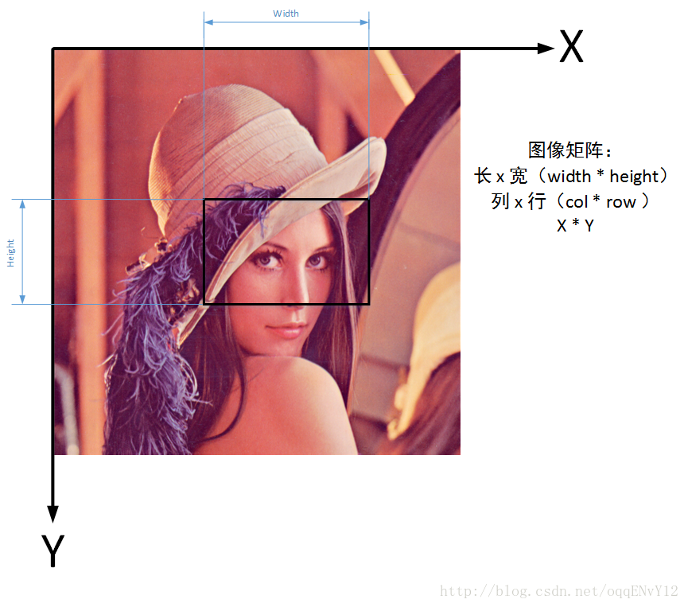

The correspondence between the image coordinate system and the width and height of rows and columns is roughly as follows:
- row == height == Point.y
- col == width  == Point.x

Because in the computer, the image is saved in the form of a matrix.

A grayscale image with a width of 640 pixels and a length of 480 pixels is stored in a 480 * 640 matrix.

## First row, then column

The coordinate representation we are used to is X-axis first, then Y-axis.
In OpenCV, the matrix needs to be calculated, first row and then column.

## Supplement (detailed explanation)
The zero point coordinate in the coordinate system is the upper left corner of the picture, the X axis is the horizontal line above the image rectangle; the Y axis is the vertical line on the left side of the image rectangle. This coordinate system is applicable to structures such as Mat, Rect, and Point~~（虽然网上有学着说opencv中有些数据结构的坐标原点是在图片的左下角，但是我暂时还没碰到过）。~~

When using image.at(x1, x2) to access the value of a point in an image, x1 is not the x-coordinate of the corresponding point in the picture, but the y-coordinate of the corresponding point in the picture. Therefore, the result of the visit is actually to visit the Point(x2, x1) point in the image image, which is the same as image.at(Point(x2, x1)).

If the image drawn is multi-channel, for example, the number of channels of the image image is n, when Mat::at(x, y) is used, the range of x is still from 0 to the height of the image, and the value range of y It is the width from 0 to image multiplied by n, because there are n channels at this time, so each pixel needs to occupy n columns. But if in the same situation, use Mat::at(point) to access, then you don’t need to consider the number of channels at this time, because when you want to assign to get the value of Mat::at(point), none of them A number, but a corresponding n-dimensional vector.
